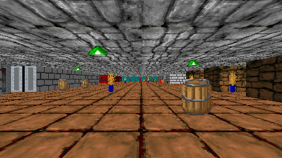

# Pseudo3D

A collection of stb-style single-header libraries written in C99 for pseudo-3D rendering.

- **Software rendered** — output is a plain RGBA32 pixel buffer; use any graphics/window library (SDL, raylib, a terminal, ...) to display it (see examples)
- **Zero dependencies** — C99 + libc, no heap allocation; all buffers are provided by the caller
- **Multi-threading friendly** — render targets can be split into column slices, letting you call render functions from multiple threads

## Raycast (`p3d_raycast.h`)

A simple raycast engine in the spirit of Wolfenstein 3D. The core is based on Lode Vandevenne's [excellent tutorial series](https://lodev.org/cgtutor/raycasting.html), with several additions:

- Sub-pixel accurate texture mapping (no ugly rounding artifacts at low resolutions)
- Depth-based lighting and fog with configurable color, falloff, and face shading
- Sliding doors (Wolfenstein style)
- Vertical camera movement and pitch rotation
- Per-face wall textures

Refer to `p3d_raycast.h` for API documentation.

## Voxelspace

TBD

## TODO

- [ ] Add helper functions to the raycast library (camera rotation, sane default structs for fog and lighting, etc.)
- [ ] Add documentation to the `p3d_raycast.h` header
- [ ] Add [voxelspace](https://github.com/s-macke/VoxelSpace) library
- [ ] Maybe add a [DOOM-style](https://www.youtube.com/watch?v=HQYsFshbkYw) library?

## License

MIT — see [LICENSE](LICENSE). The raycasting core is derived from Lode Vandevenne's
tutorial code (BSD 2-Clause); see [THIRD-PARTY-NOTICES.txt](THIRD-PARTY-NOTICES.txt).
